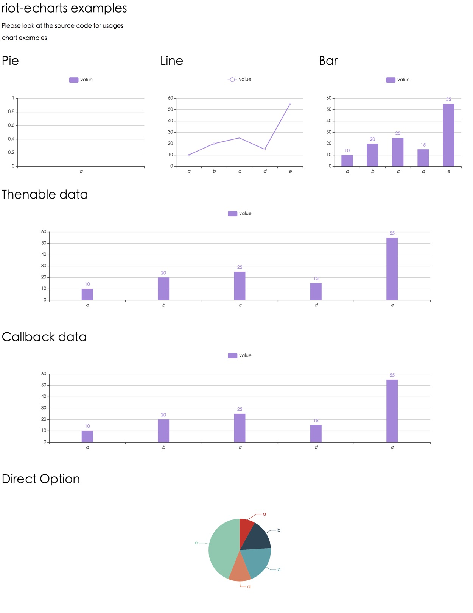

# riot-echarts

a no-brainer riot tag to display charts easily with [Baidu ECharts](https://github.com/ecomfe/echarts), like Google Chart does.



## usage

import ECharts or use CDN

```sh
https://cdn.bootcss.com/echarts/3.3.2/echarts.min.js
```

install riot-echarts
```sh
npm install riot-echarts --save
```

import riot-echarts
```js
import 'riot-echarts'
```

```html
<app>
    <p>chart</p>
    <echart simple="{ option }"></echart>
    <script>
        this.option = {type:'pie',
            data: [
                ['name', 'value'],
                ['a', 10],
                ['b', 20],
                ['c', 25],
                ['d', 15],
                ['e', 55]
            ]
        }
    </script>
    <style>
        echart {
            display:block;
            width: 100%;
            height: 500px;
        }
    </style>
</app>
```

Note: the container of charts must have a fixed height and width before chart rendering.

For more information, see example.

## License

MIT